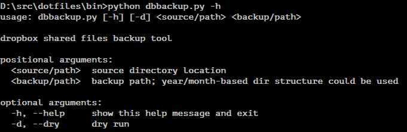

# db-backup

A backup script for dropbox file archives.

Command line options:



Usage example for Windows environment:

```bat
python %~dp0dbbackup.py "%userprofile%\Desktop\Dropbox\Shared Files" "e:\dropbox-backup\%%Y-%%m" %1
```

Scheduling to run each sunday at 23:00:

```bat
at 23:00 /every:Su "D:\src\dotfiles\bin\dbbackup.bat"
```

Sample run:

```
2013/02/17 14:04:27 INFO: source path: C:\Users\alex\Desktop\Dropbox\Shared Music
2013/02/17 14:04:27 INFO: backup path: e:\mp3\dropbox-music\%Y-%m
2013/02/17 14:04:27 INFO:  - copying 'Artist - Album (2012)' to 'e:\mp3\dropbox-music\2013-02'...
2013/02/17 14:04:28 INFO:  - copying 'Another Artist - Album (2013)' to 'e:\mp3\dropbox-music\2013-02'...
2013/02/17 14:04:28 INFO: done
```

Result:


